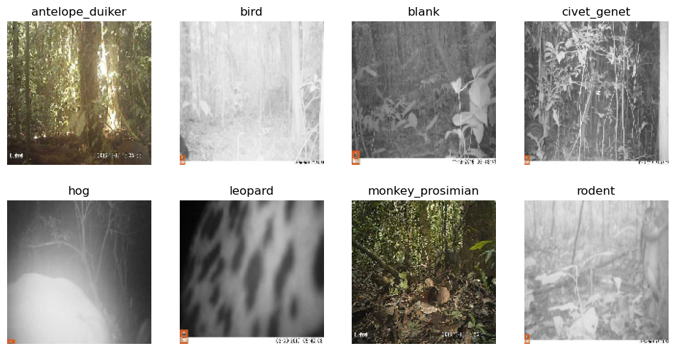
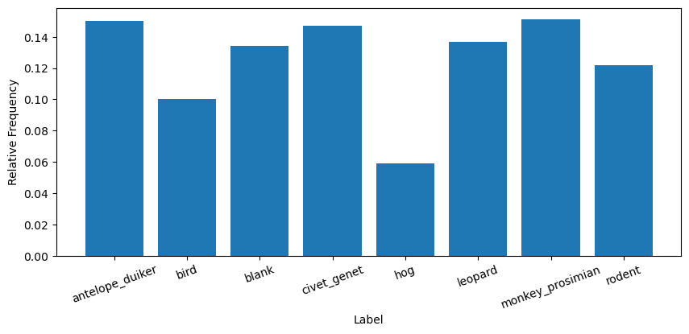
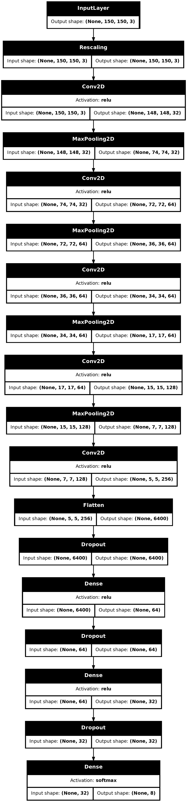

## Wildlife Species Classification from Camera Trap Images

### Problem Statement

Automated surveillance systems called camera traps play an important role in conservation reserach, as it allows researchers to passively record the behavior of animal species in their natural habitat without significant human interference. This data can be used, for example, to study the effects of climate change or wildlife encroachment, by tracking shifts in animal habitats over time. While these systems make data collection easy, it becomes difficult or impossible to analyze the vast quantity of data that they generate. Machine learning systems can help researchers sift through these camera trap images and identify the most important captures by detecting, classifying, and localizing species, among other tasks.

In this project, our aim is to develop a model for classifying such camera trap images into one of eight categories, corresponding to seven animal species, and a single category for images in which no animal is present.

The original task is described in the [DrivenData competition](https://www.drivendata.org/competitions/87/competition-image-classification-wildlife-conservation/).

### Data

In the original challenge, we are provided with three CSV files:
- training_set_features.csv
- training_set_labels.csv
- test_set_features.csv

Each row in the above datasets represents an individual image captured from a camera trap located in a specified "site", or zone of the conservation area. The files `training_set_features.csv` and `test_set_features.csv` have rows consisting of an image id, along with the path of the corresponding image in the `train_features` and `test_features` folders, and the site id of the site where the image was captured. The file `training_set_labels.csv` have rows consisting of an image id, as well as eight binary columns corresponding to the one-hot representation of the image label (i.e. what animal is present in the image).



Since the challenge does not provide us with the test set labels, we treat the provided training set as the full data set. Thus, we split the provided training set into training and test sets to train and validate our model, as well to report the final out-of-sample performance on the test set.

### Evaluation Metric and Data Splits

Although the official competition measures classification performance using cross-entropy loss, we use accuracy instead. A quick inspection of the label distribution does not suggest any severe class imbalance. Most labels are roughly within 2 percentage points of 12% of the overall data. The biggest outlier is the `hog` label, which encompasses roughly 6% of the data.



We proceed to split the training set into a train, validation, and test set according to a 70-15-15 split. These splits are stratified, so as to maintain the label proportions. More detailed exploratory analysis of the data can be found in the `exploratory_data_analysis.ipynb` notebook.

### Model

The amount of training data available after performing the train-validation-test split is roughly 12k images. This is a rather small dataset for image classification tasks, so we are restriced to using smaller models. This is because a network with too many parameters could easily overfit the training data. Our model is a fairly small convolutional neural network (CNN) model.

Initially, we resize all images to dimension `(150, 150, 3)` and rescale pixel values to be in the interval `[0, 1]` by applying a scale factor of `1/255`. Then we apply 5 convolutional layers with an increasing number of filters, while the max pooling layers in between each convolutional layer halves the input dimensionality at each step. After the final convolutional layer, we have 256 5x5 feature maps, which are then flattened to a rank-1 tensor and passed through 3 Dense layers, with Dropout layers in between. The final Dense layer maps to $\mathbb{R}^8$, and we apply a softmax activation to get a predicted probability distribution over the labels.

<p align='center' width='100%'>

</p>

The small "from-scratch" CNN model achieves an accuracy of 85% on the held out test set. The full process of hyperparameter tuning, training, and model selection can be seen in the `small_cnn_model.ipynb` notebook.

### Install Dependencies

The dependencies for this project can be installed using `pipenv`. First, install `pipenv` using `pip`:

```
pip install pipenv
```

Then, the dependencies can be installed by first changing directory into the root folder of this project, and then running the following:

```
pipenv install
```

Note that this will create a virtual environment for this project. The virtual environment can be activated by running:

```
pipenv shell
```

### Downloading the Dataset and Creating Directories by Split

Since the data directory is too large to store on GitHub, there are two scripts that will do the following: download the compressed dataset, split the data according to the chosen train-validation-test proportions, and create the hierarchical data directory structure expected by the `image_dataset_from_directory` function from Keras.

First, run the following script to download the compressed dataset:

```
python scripts/data/download_dataset.py
```

Then, run the following script to create the directory structure:

```
python scripts/data/create_directories_by_split.py
```

### Training the Model

The `bin/custom` directories already contain the best models (by validation loss) for each run of hyperparameter tuning. The best overall model is `custom_dropout_0.5_100_0.846_0.521.keras`, and this is the one that we put into production.

In order to train this model (with the same hyperparameter values), run the following script:

```
python scripts/train.py
```

This script will save the best performing model (with lowest validation loss) as `best_model.keras` in the `bin/custom` folder.

### Deploying the Model

There are two approaches we took for deploying the model, both locally and on Amazon Web Services (AWS). The primary difference between the approaches is that the first approach uses the full TensorFlow library in deployment, and the second approach uses TensorFlow Serving, which is better optimized for deployment scenarios for two main reasons:
1. It is a lightweight system specifically made for serving trained models, and thus, discards all features of TensorFlow besides inference capabilities. It also has a highly optimized, low-level implementation in C++.
2. It supports serving models via gRPC, which is a data format that encodes data using a more efficient binary representation. This makes it more efficient than JSON, which is based on key-value pairs and high-level data structures such as strings, numbers, and objects. The catch is that deployment involves more moving parts and complex logic.

### Deploying with Vanilla TensorFlow

#### Deploying Locally with Docker and Flask

#### Deploying to the Cloud (AWS Lambda)

### Deploying with TensorFlow Serving

#### Deploying Locally with Docker-Compose

#### Deploying Locally with Kubernetes

#### Deploying to the Cloud (AWS Elastic Kubernetes Service)